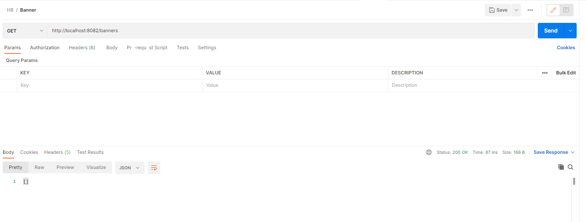
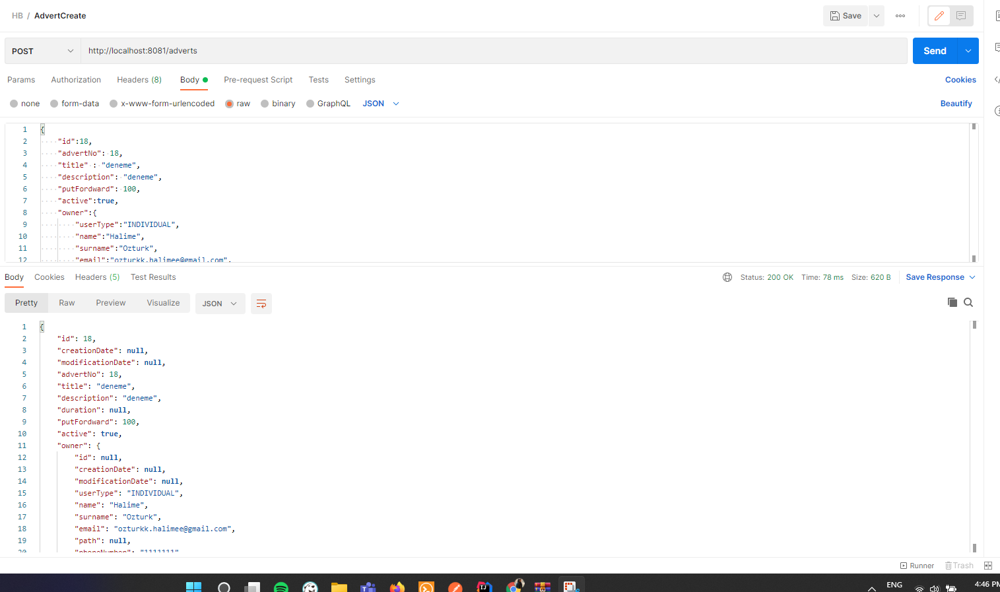
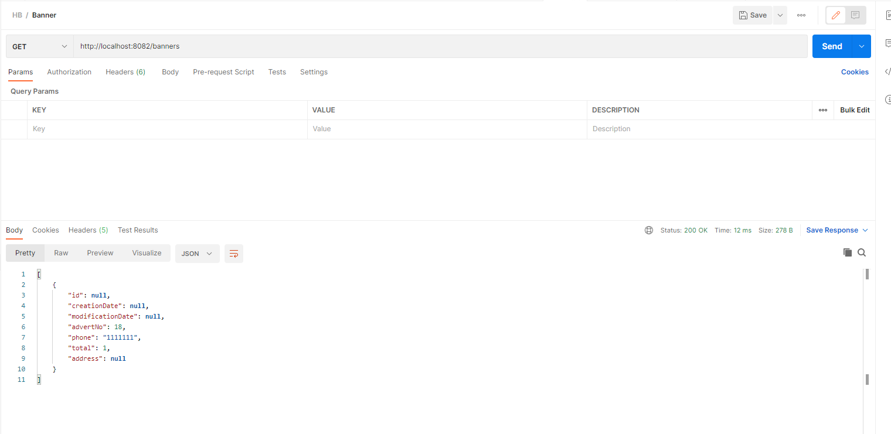
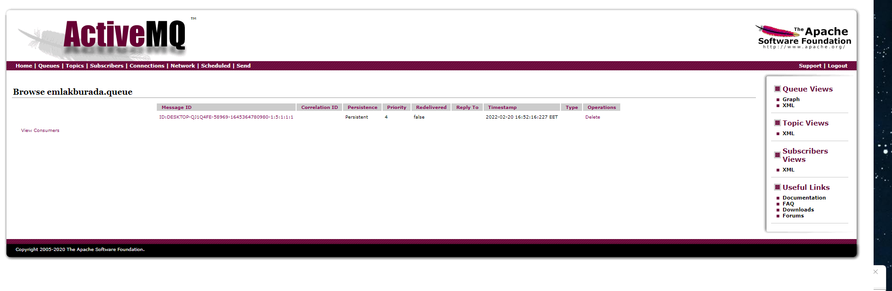
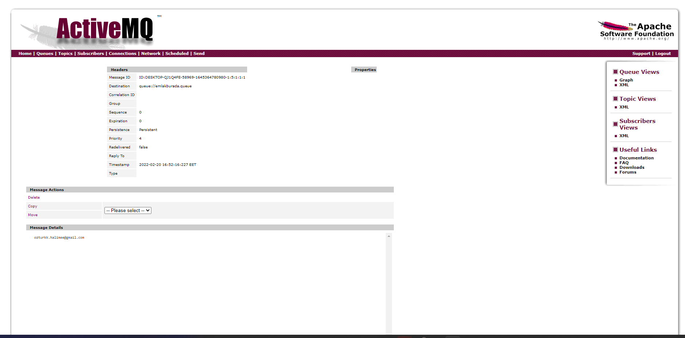
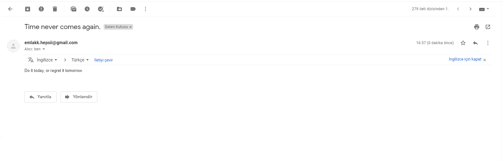

# HepsiEmlak Homework 3

# 1. Madde

Görüldüğü gibi banner boş.

Advert tablosuna kayıt atarsam banner içinde kayıt atar.

Ve Bannerın içi şu şekilde olur.

# 2. Madde

Advert e kayıt atıldığında ActiveMq ile kuyruğa yazıyorum email servisinde kuyruğu dinleyip kuyruğa yazılan e-posta adresine email atıyorum.

# 3. Madde

### User Controller
    @RestController
    @RequestMapping("/users")
    @RequiredArgsConstructor
    public class UserController {

        private final UserService userService;
    
        @GetMapping
        ResponseEntity<List<UserDTO>> getAllList(){
            return ResponseEntity.ok(userService.getAllList());
        }
    
        @PostMapping
        ResponseEntity<UserDTO> create(@RequestBody UserDTO userDTO){
            return ResponseEntity.ok(userService.create(userDTO));
        }
    
        @GetMapping("/{id}")
        ResponseEntity<UserDTO> getUserById(@PathVariable Long id){
            return ResponseEntity.ok(userService.getUserById(id));
        }
    }
### User Service
    @Service
    @RequiredArgsConstructor
    public class UserService {
    private final UserMapper userMapper;
    private final UserRepository userRepository;

        public List<UserDTO> getAllList() {
            return userMapper.toDTOList(userRepository.getAllList());
        }
    
        public UserDTO create(UserDTO userDTO) {
            return userMapper.toDTO(userRepository.create(userMapper.toEntity(userDTO)));
        }
    
        public UserDTO getUserById(Long id){
            return userMapper.toDTO(userRepository.getUserById(id));
        }
    }
### User Repository
    public List<User> getAllList() {
        return userList;
    }

    public User create(User user) {
        userList.add(user);
        return user;
    }

    public User getUserById(Long id){
        return userList.stream().filter(i->i.getId().equals(id)).findAny().orElse(new User());
    }

### Message Controller
    @RestController
    @RequestMapping("/messages")
    @RequiredArgsConstructor
    public class MessageController {
        private final MessageService messageService;
    
        @GetMapping
        ResponseEntity<List<MessageDTO>> getAllList(){
            return ResponseEntity.ok(messageService.getAllList());
        }
    
        @PostMapping
        ResponseEntity<MessageDTO> create(@RequestBody MessageDTO messageDTO){
            return ResponseEntity.ok(messageService.create(messageDTO));
        }
    
        @GetMapping("/{id}")
        ResponseEntity<MessageDTO> getMessageById(@PathVariable Long id){
            return ResponseEntity.ok(messageService.getMessageById(id));
        }
    }

### Message Service
    @Service
    @RequiredArgsConstructor
    public class MessageService {
        private final MessageMapper messageMapper;
        private final MessageRepository messageRepository;
    
        public List<MessageDTO> getAllList() {
            return messageMapper.toDTOList(messageRepository.getAllList());
        }
    
        public MessageDTO create(MessageDTO messageDTO) {
            return messageMapper.toDTO(messageRepository.create(messageMapper.toEntity(messageDTO)));
        }
    
        public MessageDTO getMessageById(Long id){
            return messageMapper.toDTO(messageRepository.getMessageById(id));
        }
    }

### Message Repository
    public List<Message> getAllList() {
        return messageList;
    }

    public Message create(Message message) {
        messageList.add(message);
        return message;
    }

    public Message getMessageById(Long id){
        return messageList.stream().filter(i->i.getId().equals(id)).findAny().orElse(new Message());
    }

# 4. Madde
### Benim favori ilanlarım Real Estate ile ilişkili bu yüzden 4. maddeyi burada yaptım

    @GetMapping("/userId/{userId}")
    ResponseEntity<Set<RealEstateDTO>> getAdvertListWithUserId(@PathVariable long userId){
    return ResponseEntity.ok(realEstateService.getRealEstateListWithUserId(userId));
    }

    public Set<RealEstateDTO> getRealEstateListWithUserId(long userId){
        return realEstateMapper.toAdvertDTOList(new HashSet<>(userRepository.getUserById(userId).getFavorite()));
    }

    public User getUserById(Long id){
        return userList.stream().filter(i->i.getId().equals(id)).findAny().orElse(new User());
    }
